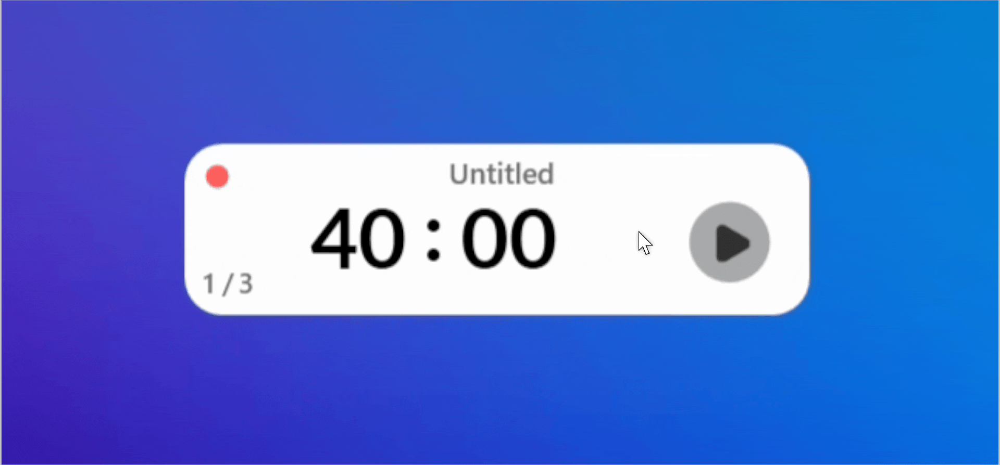

# FlowOne 🍅

<p align="center">
  
</p>

 

**FlowOne** is a minimalist, modern Pomodoro timer for **Windows 10/11** built with WPF and .NET 8. Designed to stay out of your way while keeping you focused, it features a compact, floating UI with customizable session settings.

## ✨ Features

* **Minimalist Interface:** A compact, transparent window (310x86) that floats on top of other windows.
* **Pomodoro & Break Cycles:** Automatically handles switching between focus sessions and short breaks.
* **Focus Mode:** Indicated by a Red status light (#FF5F5F).
* **Break Mode:** Indicated by a Green status light (#78C864).


* **Task Tracking:** Built-in editable task box to label your current focus session.
  * *Tip: Double-click the text to edit your task name*.


* **Session Management:**
  * Tracks completed sessions vs. total goal (e.g., 1/4).
  * Configurable total session goals via Settings.


* **Smart Controls:**
  * **Play/Pause/Stop:** Standard timer controls with smooth transition animations.
  * **Skip:** Instantly skip the current session or break.
  * **+1 Minute:** Quickly add an extra minute to your current timer.


* **Customizable Settings:** Adjust Pomodoro duration, break duration, and total session targets.
* **Audio Notifications:** Plays a distinct sound (`timer_ends.mp3`) when a session completes.

## 🛠️ Tech Stack

* **Framework:** .NET 8.0 (Windows)
* **UI System:** Windows Presentation Foundation (WPF)
* **Styling:** Custom XAML with Lato font integration and drop-shadow effects.

## 🚀 Getting Started

### Prerequisites

* Windows OS
* [.NET 8.0 Desktop Runtime](https://dotnet.microsoft.com/en-us/download/dotnet/8.0)

### Installation & Run

1. **Clone the repository:**
    ```bash
    git clone https://github.com/kavinmk05/flowone.git
    cd flowone
    
    ```


2. **Open the solution:**
  Open `WpfApp1.sln` in Visual Studio 2022.
3. **Build and Run:**
  Press `F5` to start the application.

## 🎮 Usage Guide

1. **Start a Session:** Click the **Play** button to begin your focus timer.
2. **Edit Task:** Double-click "Flow one" (or the current text) to type your specific task name. Press `Enter` to save.
3. **Settings:** Hover over the left side to reveal the **Menu** icon. Click it to open Settings and configure:
    * Pomodoro Length (minutes)
    * Break Length (minutes)
    * Total Sessions Goal


4. **Drag & Drop:** Click and hold anywhere on the white background to move the widget around your screen.

## 📂 Project Structure

* `MainWindow.xaml`: The main timer UI and logic.
* `settings_window.xaml`: Configuration dialog for timer durations.
* `assets/`: Contains icons (Vector, menu, pause) and fonts (Lato family).

## 👤 Author

**kavinmk05**

---

*Built with focus in mind.*
